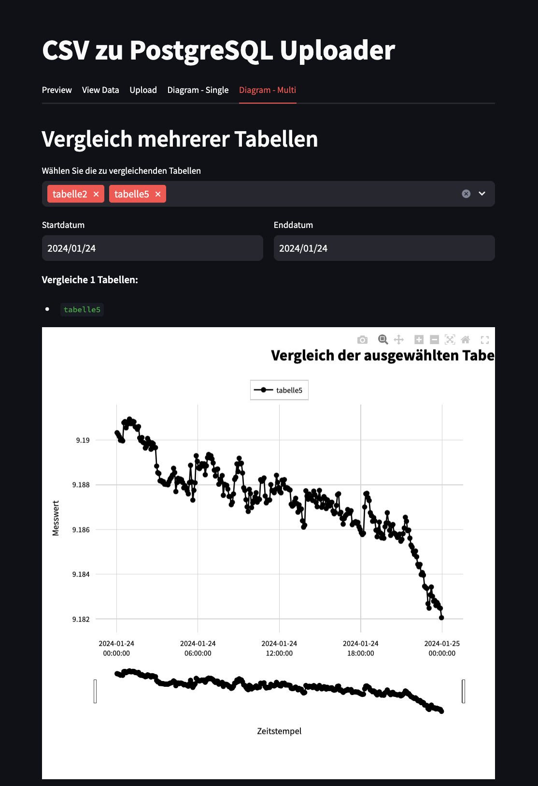

# Übersicht

Diese Anwendung ermöglicht die Visualisierung und Verwaltung von bereitgestellten CSV Daten, die in einer PostgreSQL-Datenbank gespeichert sind. Sie besteht aus einer Weboberfläche (`index.html`), einem Backend-Skript zur Datenabfrage (`getData.php`), und einem Streamlit-basierten Python-Skript (`test.py`) zur Datenverarbeitung und -visualisierung.

   
   
   

## Vorbedingungen

### Systemvoraussetzungen

- macOS (für Windows und Linux können die Schritte leicht abweichen)
- Terminalzugriff
- Internetverbindung


### Software installieren

Führen Sie folgende Schritte im Terminal aus, um alle notwendigen Softwarekomponenten zu installieren:

1. **Homebrew installieren**  
   ```bash
   /bin/bash -c "$(curl -fsSL https://raw.githubusercontent.com/Homebrew/install/HEAD/install.sh)"
   ```

2. **PostgreSQL installieren**  
   ```bash
   brew install postgresql
   ```

3. **Python installieren**  
   ```bash
   brew install python
   ```

4. **PHP installieren**  
   ```bash
   brew install php
   ```

### Datenbank einrichten

1. Starten Sie den PostgreSQL-Dienst:
   ```bash
   brew services start postgresql
   ```
   Führen Sie alternativ den Installations- und Einrichtungsprozess durch https://www.postgresql.org/download/

2. Der Username/admin ist "postgres"
3. Vergeben Sie das Userpasswort "123456"
4. Öffnen Sie den Terminal
5. Verbinden Sie sich mit der Datenbank
   ```bash
   psql -U postgres
   ```
6. Geben Sie "123456" als Passwort ein und bestätigen Sie mit Enter
   
8. Erstellen Sie die Datenbank:
   ```sql
   CREATE DATABASE examdb;
   ```
9. Beenden Sie die Sitzung:
   ```sql
   \q
   ```

## Anwendung starten (`test.py`)

1. Navigieren Sie zum Projektverzeichnis:
   ```bash
   cd /path/to/csvManagementSystemv2
   ```
2. Erstellen und Aktivieren Sie die virtuelle Umgebung:
   ```bash
    python3 -m venv path/to/venv
    source path/to/venv/bin/activate
    pip install --upgrade pip
   
   ```
3. Installieren Sie die Bibliotheken:
   ```bash
   pip install -r requirements.txt
   ```

3. Starten Sie die Anwendung:
   ```bash
   python3 -m streamlit run test.py
   ```

## Funktionen des Programms

### 1. Tabelle Erstellen
0. Vorbedingung:
   - Die Tabellenverwaltung ist ausgeklappt
   - Datenbank "examDB" ist eingerichtet
   - Datenbankverbindung ist online
   - Internetverbindung ist online
   
1. Klicken Sie auf den Tab "Neue Tabelle"
2. Geben Sie im Eingabefeld den Namen der Tabelle ein
3. Klicken Sie auf den Button "Tabelle erstellen"
4. Wiederholen Sie diesen Vorgang 6 mal
   


### 2. Tabelle Löschen
0. Vorbedingung:
   - Die Tabellenverwaltung ist ausgeklappt
   - Es wurde eine Tabelle angelegt
   - Datenbank "examDB" ist eingerichtet
   - Datenbankverbindung ist online
   - Internetverbindung ist online
     
1. Klicken Sie auf den Tab "Tabelle löschen"
2. Wählen Sie per Dropdown eine Tabelle aus
3. Klicken Sie auf den Button "Tabelle löschen"
4. Bestätigen Sie mit dem Button "Bestätigen"
5. Prüfen Sie ob ein grünes PopUp Fenster erscheint


### 3. Tabellen wechseln
0. Vorbedingung:
      - Die Tabellenverwaltung ist ausgeklappt
      - Es sind mehrere Tabellen angelegt
      - Datenbankverbindung ist online
      - Internetverbindung ist online
      - Datenbank "examDB" ist eingerichtet
        
1. Wählen sie unter "Vorhandene Tabellen" in der Sidebar die gewünschte Tabelle aus


### 4. CSV-Datei Import
0. Vorbedingung:
   - Datenbankverbindung ist online
   - Internetverbindung ist online
   - Datenbank "examDB" ist eingerichtet
   - Die Tabellenverwaltung ist ausgeklappt
   - Die aktelle Tabelle ist unter "Vorhandene Tabellen" ausgewählt
1. Klicken Sie auf den Tab "Upload"
2. Klicken Sie auf den Button "Browse Files"
   

3. Laden Sie die bereitgestellte Datei aus und bestätigen Sie mit "'Dateiname' übertragen'"

   


### 5. Datenanalyse 
0. Vorbedingung:
   - Es sind Tabellen angelegt
   - Datenbank "examDB" ist eingerichtet
   - Datenbankverbindung ist online
   - Internetverbindung ist online
   - Es wurden erfolgreich CSV Daten importiert
   - Es ist eine Tabelle über die "Tabellenverwaltung" ausgewählt
1. Klicken Sie auf den Tab "View Data"
2. Prüfen Sie ob Datensätze geladen sind


### 6. Datenvisualisierung
0. Vorbedingung:
   - Es sind Tabellen angelegt
   - Datenbank "examDB" ist eingerichtet
   - Datenbankverbindung ist online
   - Internetverbindung ist online
   - Es wurden erfolgreich CSV Daten importiert
   - Eine oder mehrere Tabelle sind ausgewählt
   - Es wurde das korrekte Start und Enddatum ausgewählt
     
1. Klicken Sie auf den Tab "Diagram Multi"
2. Prüfen Sie ob Datensätze geladen sind




### 7. Datenvisualisierung mit Graphmanipulationen
0. Vorbedingung:
    - Es sind Tabellen angelegt
   - Datenbank "examDB" ist eingerichtet
   - Datenbankverbindung ist online
   - Internetverbindung ist online
   - Es wurden erfolgreich CSV Daten importiert
   - Eine oder mehrere Tabelle sind ausgewählt
   - Es wurde das korrekte Start und Enddatum ausgewählt
     
1. Öffnen Sie den Tab "Visualisierungsoptionen"
2. Prüfen Sie die Registeroptionen "Grundeinstellungen", "Statistische Anzeigen", "Erweiterte Analysen "sich öffnen


### 8. Performance-Optimierung
- Connection Pooling für effiziente Datenbankverbindungen
- Caching von häufig verwendeten Daten
- Chunk-basiertes Laden großer Datensätze
- Automatisches Recycling von Datenbankverbindungen


### 9. Fehlerbehandlung
- Robuste Fehlerbehandlung bei Datenbankoperationen
- Benutzerfreundliche Fehlermeldungen
- Validierung von Eingabedaten
- Automatische Wiederherstellung bei Verbindungsabbrüchen


### 10. Benutzeroberfläche
- Übersichtliches Streamlit Interface
- Intuitive Navigation
- Responsive Designanpassung
- Fortschrittsanzeigen bei längeren Operationen


### 11. Backend-Architektur

#### Datenbankanbindung
- PostgreSQL als robuste, relationale Datenbank
- SQLAlchemy als ORM (Object-Relational Mapping)
- Optimierte Verbindungsverwaltung durch Connection Pooling
- Konfigurierbare Datenbankparameter (Host, Port, Credentials)

#### Datenverarbeitung
- Pandas für effiziente Datenmanipulation
- Chunk-basierte Verarbeitung großer Datensätze
- Automatische Datentyperkennung
- Optimierte Speichernutzung durch gezieltes Memory Management

#### Caching-Strategie
- Mehrschichtiges Caching-System:
  - Datenbankabfragen (TTL: 5 Minuten)
  - Tabellenstrukturen
  - Berechnungsergebnisse
- Automatische Cache-Invalidierung
- Memory-effiziente Cache-Verwaltung

#### API-Struktur
- Modulare Funktionsaufteilung
- Wiederverwendbare Datenbankoperationen
- Standardisierte Fehlerbehandlung
- Asynchrone Verarbeitung für zeitintensive Operationen

#### Sicherheitsaspekte
- Parametrisierte SQL-Abfragen
- Eingabevalidierung
- Sichere Verbindungshandhabung
- Automatisches Verbindungs-Timeout

#### Performance-Optimierung
- Indexierung wichtiger Spalten
- Optimierte SQL-Abfragen
- Lazy Loading von großen Datensätzen
- Effiziente Speichernutzung durch Datentyp-Optimierung
